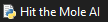

# Welcome to the Whac-A-Mole-AI!
# Instructions:
1. You will need a code editor (a python compiler). I use Visual Studio Code, although I recommend IDLE. Watch the beginning of my python tutorial: (https://www.youtube.com/watch?v=lR5jPT4JLts&t=44s) to learn how to set it up.
2. Press on the green button at the top of this page, that says .
3. Press on that, and then press on "Download ZIP".
4. In your downloads, extract the ZIP file (right-click > "extract files" (or "extract here")).
5. Double-click on 
6. At the top, press on run, then "Run Module" (F5).

Comment in this video your Ai's high-score. Mine is 3150.
Enjoy
